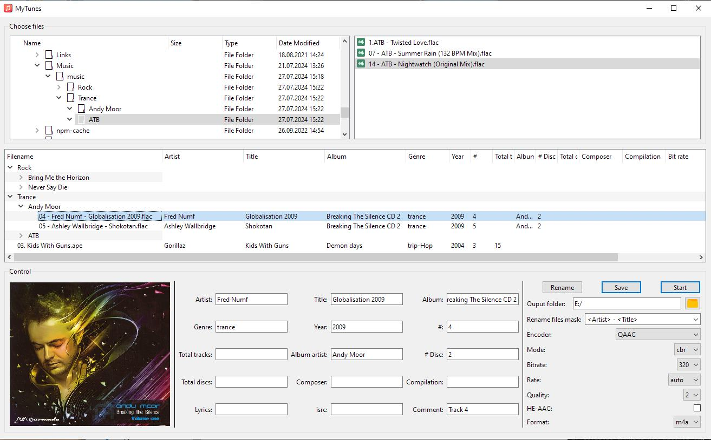

# MyTunes

Audio converter & tags editor.

Can use Apple AAC encoder instead of FDK AAC for the better quality. For another codecs using ffmpeg.




Base feature:

* mass tags edit and files rename
* convert only lossless format, others copy to destination
* save directory structure


## Installation

### QuickTime AAC encoder

Instead of ffmpeg AAC encoder (FDK) you can use Apple encoder without QuickTime installation.

1. Download **qaac (CLI QuickTime AAC/ALAC encoder)**
2. Place dll's and exe files in to **qaac** folder
3. Download the latest QTfiles.7z (if you are using qaac.exe) or QTfiles64.7z (if you are using qaac64.exe).
4. Place dll's in the same folder as qaac64.exe.
5. Download ffmpeg. 

Files tree:
```shell
myTunes
├───bin
│  ├───ffmpeg
│  │  
└───ffmpeg files
|   └───qaac
|   ├─── qaac files
|   └─── lQTfiles64 dll files
├─── MyTunes.exe
└─── settings.ini
```


## Configuration

Settings are stored in **settings.ini**

### logging

- level - see python logging level
- max_mb - max size for log file before he will be zipped


### converter
- temp_path - temp directory
- ffmpeg - destination to executable ffmpeg
- qaac - destination to executable qaac

